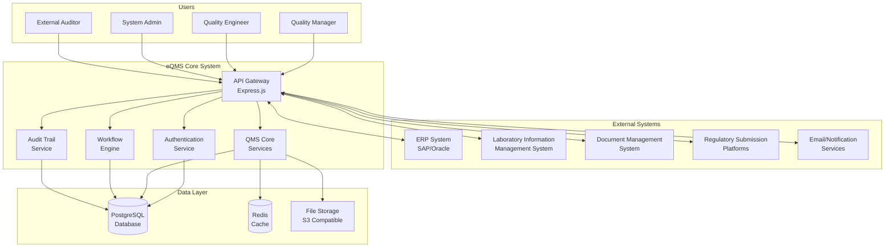
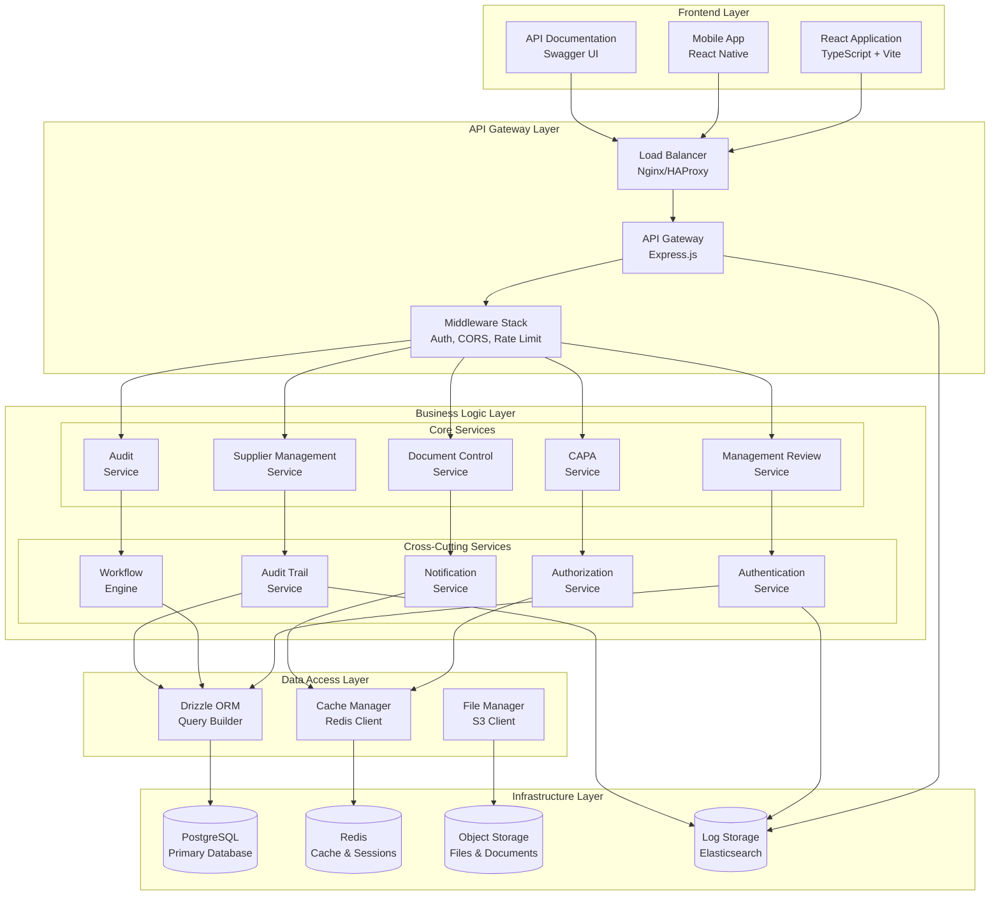
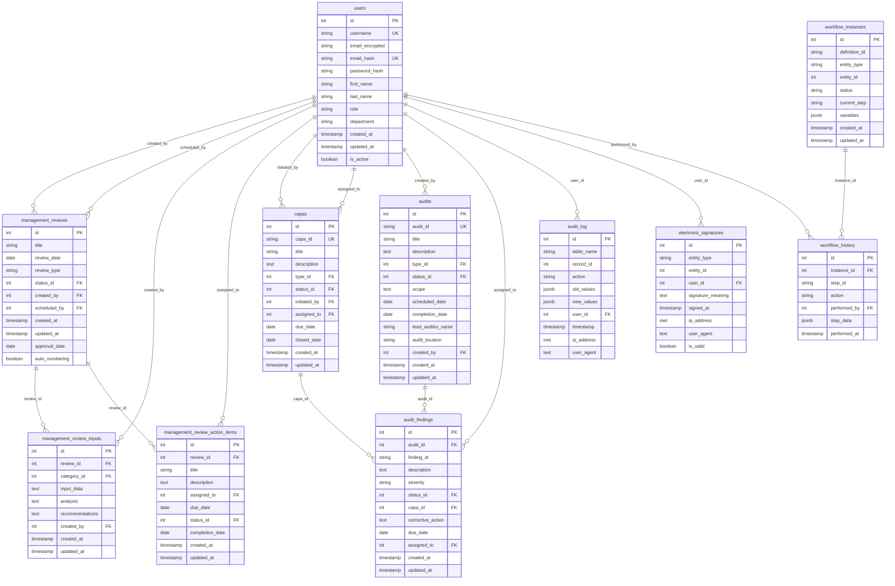
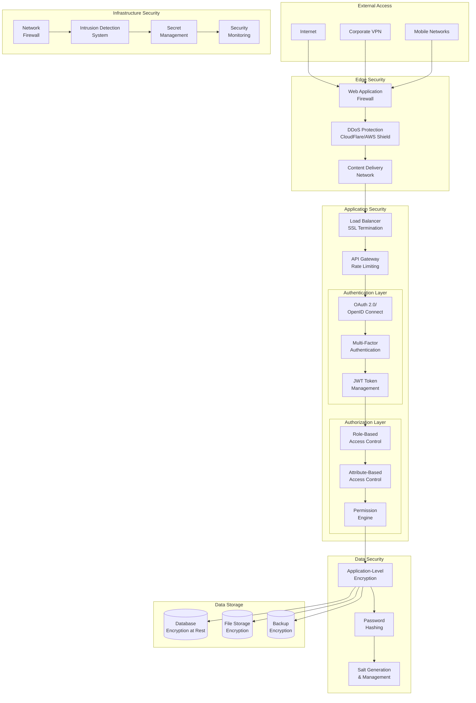
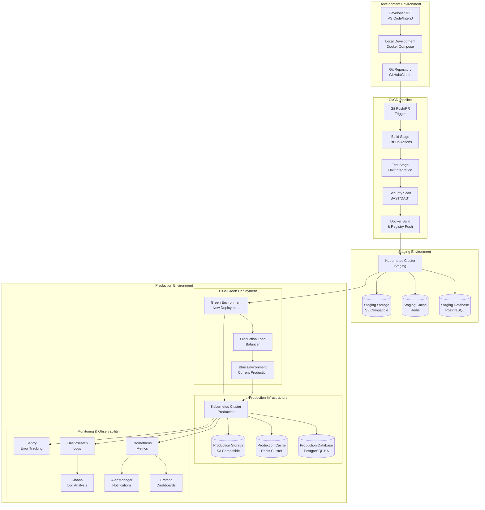
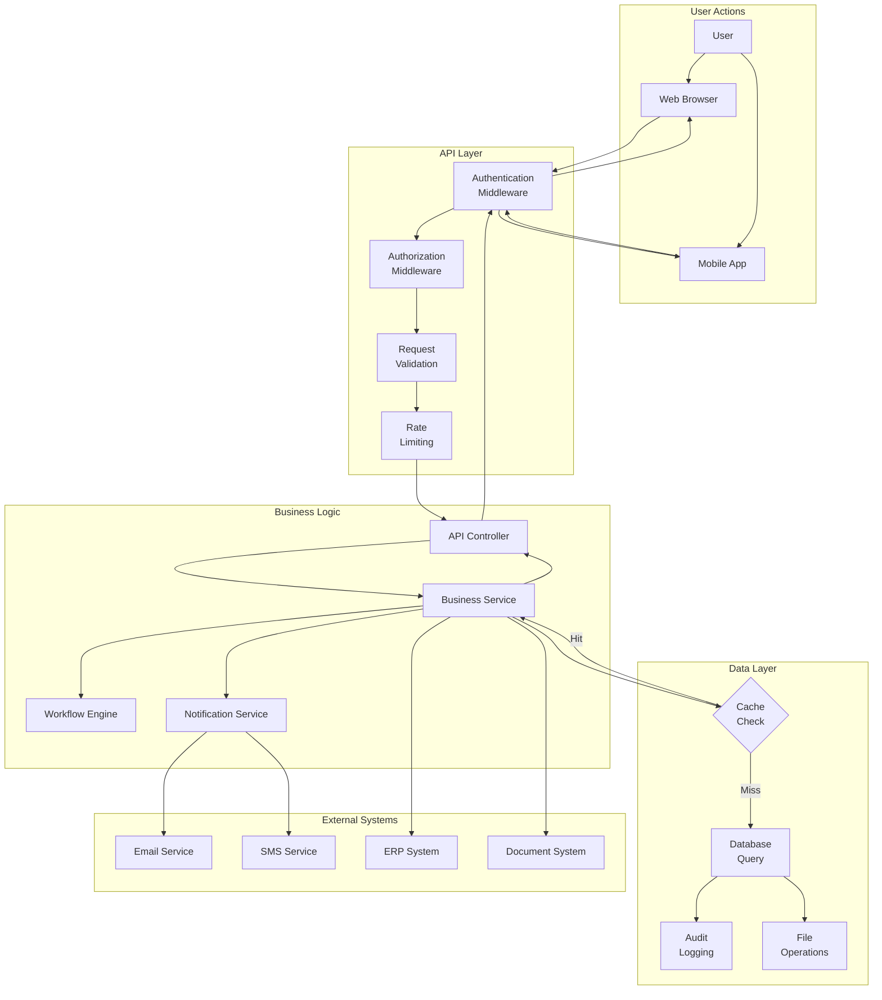
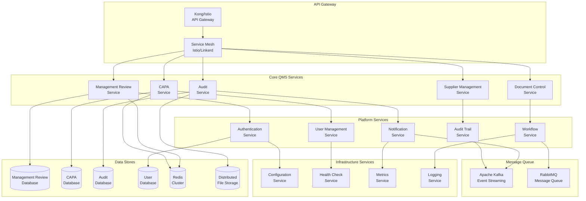
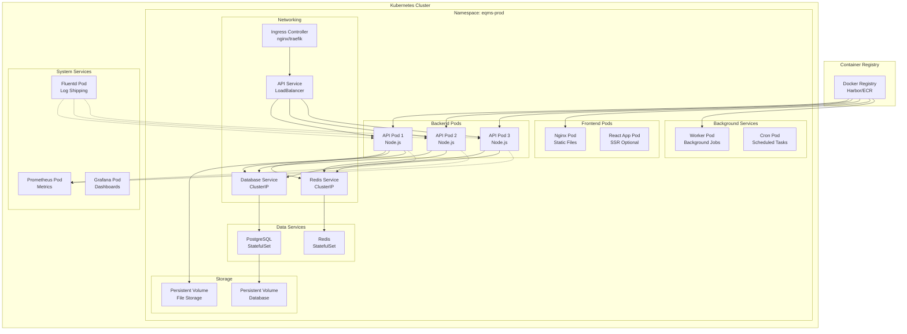

# Architectural Diagrams
## eQMS System Architecture

**Document Control Information**
- Document ID: ARCH-eQMS-2025-001
- Version: 1.0
- Date: June 4, 2025
- Author: Senior Software Development Team
- Classification: Controlled Document

---

## 1. System Context Diagram

---

## 2. Application Architecture Diagram

---

## 3. Database Architecture Diagram

---

## 4. Security Architecture Diagram

---

## 5. Deployment Architecture Diagram

---

## 6. Data Flow Diagram

---

## 7. Microservices Architecture (Future State)

---

## 8. Container Architecture Diagram

This comprehensive architectural documentation provides detailed visual representations of the eQMS system architecture from multiple perspectives, supporting the design and implementation of a robust, scalable, and compliant quality management system.