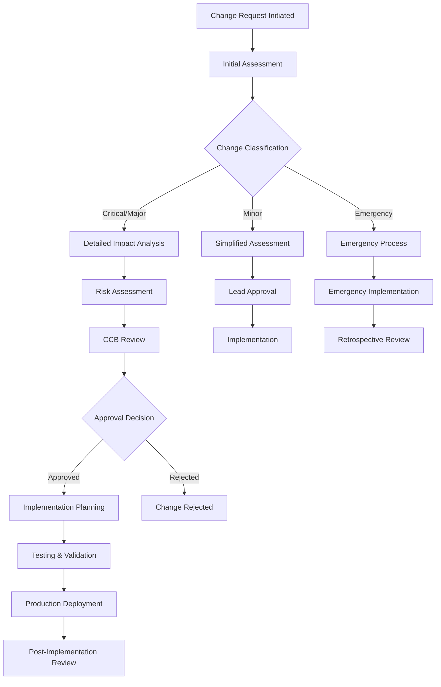

# Change Control Strategy
## Software Change Management Process for eQMS

**Document Control Information**
- Document ID: CCS-eQMS-2025-001
- Version: 1.0
- Date: June 4, 2025
- Author: Change Control Board
- Classification: Controlled Document

---

## 1. Change Control Framework Overview

### 1.1 Change Control Objectives
The eQMS change control strategy ensures:
- **Regulatory Compliance**: All changes maintain FDA 21 CFR Part 11 and ISO 13485:2016 compliance
- **Quality Assurance**: Systematic evaluation of change impact on system quality
- **Risk Management**: Comprehensive assessment and mitigation of change-related risks
- **Traceability**: Complete documentation and audit trail for all changes
- **Validation Maintenance**: Preservation of system validation status

### 1.2 Change Classification

| Change Type | Description | Approval Level | Validation Impact |
|-------------|-------------|----------------|-------------------|
| **Critical** | Security, regulatory compliance, data integrity | CCB + QA Director | Full revalidation required |
| **Major** | Functional enhancements, workflow changes | CCB | Partial revalidation required |
| **Minor** | UI improvements, non-functional updates | Development Lead | Impact assessment only |
| **Emergency** | Production fixes, security patches | Emergency CCB | Retrospective validation |
| **Infrastructure** | Environment, deployment, configuration | IT Director + CCB | Infrastructure qualification |

---

## 2. Change Control Process

### 2.1 Change Request Workflow



### 2.2 Change Request Form Template

#### 2.2.1 Change Request Information
```typescript
interface ChangeRequest {
  // Basic Information
  requestId: string;
  title: string;
  description: string;
  justification: string;
  submittedBy: number;
  submittedDate: Date;
  
  // Classification
  changeType: ChangeType;
  priority: Priority;
  category: ChangeCategory;
  
  // Impact Assessment
  affectedSystems: string[];
  affectedModules: string[];
  regulatoryImpact: boolean;
  validationImpact: ValidationImpact;
  
  // Implementation Details
  proposedSolution: string;
  implementationApproach: string;
  estimatedEffort: number;
  proposedSchedule: ImplementationSchedule;
  
  // Risk Assessment
  riskAssessment: RiskAssessment;
  mitigationStrategies: string[];
  
  // Testing Requirements
  testingRequirements: TestingRequirement[];
  validationActivities: ValidationActivity[];
  
  // Approval Chain
  approvals: Approval[];
  status: ChangeStatus;
  
  // Implementation Tracking
  implementation: ImplementationRecord;
  postImplementationReview: PostImplementationReview;
}

enum ChangeType {
  CRITICAL = 'critical',
  MAJOR = 'major',
  MINOR = 'minor',
  EMERGENCY = 'emergency',
  INFRASTRUCTURE = 'infrastructure'
}

enum Priority {
  LOW = 'low',
  MEDIUM = 'medium',
  HIGH = 'high',
  URGENT = 'urgent'
}
```

#### 2.2.2 Impact Assessment Template
```typescript
interface ImpactAssessment {
  // Technical Impact
  technicalComplexity: ComplexityLevel;
  architecturalChanges: boolean;
  databaseChanges: boolean;
  apiChanges: boolean;
  securityImplications: boolean;
  
  // Business Impact
  userImpact: UserImpactLevel;
  processChanges: ProcessChange[];
  trainingRequired: boolean;
  documentationUpdates: string[];
  
  // Regulatory Impact
  regulatoryRequirements: RegulatoryRequirement[];
  complianceConsiderations: string[];
  auditTrailImpact: boolean;
  electronicRecordsImpact: boolean;
  
  // Validation Impact
  validationScope: ValidationScope;
  testingRequirements: TestingScope;
  revalidationRequired: boolean;
  
  // Risk Assessment
  identifiedRisks: Risk[];
  riskMitigations: RiskMitigation[];
  contingencyPlans: ContingencyPlan[];
}
```

---

## 3. Versioning and Branching Strategy

### 3.1 Git Branching Model

#### 3.1.1 Branch Structure
```
main (production)
├── release/v2.1.0
├── develop
│   ├── feature/CR-2025-001-management-review-enhancement
│   ├── feature/CR-2025-002-capa-workflow-improvement
│   └── feature/CR-2025-003-audit-reporting-update
├── hotfix/v2.0.1-security-patch
└── emergency/critical-fix-20250604
```

#### 3.1.2 Branch Management Rules
```yaml
# .github/branch-protection.yml
branch_protection_rules:
  main:
    required_status_checks:
      strict: true
      contexts:
        - "ci/tests"
        - "ci/security-scan"
        - "ci/compliance-check"
    enforce_admins: true
    required_pull_request_reviews:
      required_approving_review_count: 2
      dismiss_stale_reviews: true
      require_code_owner_reviews: true
      restrict_pushes: true
    
  develop:
    required_status_checks:
      strict: true
      contexts:
        - "ci/tests"
        - "ci/lint"
    required_pull_request_reviews:
      required_approving_review_count: 1
      dismiss_stale_reviews: true
    
  "release/*":
    required_status_checks:
      strict: true
      contexts:
        - "ci/tests"
        - "ci/security-scan"
        - "ci/performance-test"
    enforce_admins: true
    required_pull_request_reviews:
      required_approving_review_count: 2
      require_code_owner_reviews: true
```

### 3.2 Semantic Versioning

#### 3.2.1 Version Number Format
```
MAJOR.MINOR.PATCH[-PRERELEASE][+BUILD]

Examples:
- 2.1.0 (Major release with new features)
- 2.1.1 (Patch release with bug fixes)
- 2.2.0-rc.1 (Release candidate)
- 2.1.0+20250604.1 (Build metadata)
```

#### 3.2.2 Version Bump Criteria
```typescript
class VersionManager {
  determineVersionBump(changes: ChangeRequest[]): VersionBump {
    const hasBreakingChanges = changes.some(c => c.breakingChange);
    const hasNewFeatures = changes.some(c => c.changeType === 'MAJOR');
    const hasBugFixes = changes.some(c => c.changeType === 'MINOR');
    
    if (hasBreakingChanges) {
      return VersionBump.MAJOR;
    } else if (hasNewFeatures) {
      return VersionBump.MINOR;
    } else if (hasBugFixes) {
      return VersionBump.PATCH;
    }
    
    return VersionBump.NONE;
  }
  
  generateReleaseNotes(version: string, changes: ChangeRequest[]): ReleaseNotes {
    return {
      version,
      releaseDate: new Date(),
      breakingChanges: this.extractBreakingChanges(changes),
      newFeatures: this.extractNewFeatures(changes),
      improvements: this.extractImprovements(changes),
      bugFixes: this.extractBugFixes(changes),
      securityUpdates: this.extractSecurityUpdates(changes),
      knownIssues: this.extractKnownIssues(changes),
      migrationGuide: this.generateMigrationGuide(changes)
    };
  }
}
```

---

## 4. Change Control Board (CCB)

### 4.1 CCB Composition and Responsibilities

| Role | Responsibilities | Decision Authority |
|------|-----------------|-------------------|
| **CCB Chair (Quality Director)** | Overall change oversight, final decision | Approve/reject all changes |
| **System Owner** | Business impact assessment | Functional requirements approval |
| **Technical Lead** | Technical feasibility analysis | Technical implementation approval |
| **Security Officer** | Security impact assessment | Security-related changes |
| **Regulatory Affairs** | Compliance impact review | Regulatory compliance approval |
| **QA Representative** | Quality impact assessment | Testing and validation approval |
| **IT Operations** | Infrastructure impact analysis | Deployment and operations approval |

### 4.2 CCB Meeting Process

#### 4.2.1 Regular CCB Meetings
```typescript
interface CCBMeeting {
  meetingId: string;
  scheduledDate: Date;
  attendees: CCBMember[];
  agenda: AgendaItem[];
  changeRequests: ChangeRequest[];
  decisions: CCBDecision[];
  actionItems: ActionItem[];
  nextMeetingDate: Date;
}

interface CCBDecision {
  changeRequestId: string;
  decision: 'APPROVED' | 'REJECTED' | 'DEFERRED' | 'CONDITIONAL';
  conditions?: string[];
  votingResults: VotingResult[];
  rationale: string;
  approvedBy: number;
  approvedDate: Date;
}
```

#### 4.2.2 Emergency CCB Process
```typescript
class EmergencyCCBProcess {
  async initiateEmergencyChange(request: EmergencyChangeRequest): Promise<EmergencyApproval> {
    // Immediate notification to CCB members
    await this.notifyEmergencyCCB(request);
    
    // Risk assessment
    const riskScore = await this.assessEmergencyRisk(request);
    
    // Expedited approval process
    if (riskScore >= RiskThreshold.CRITICAL) {
      return await this.processHighRiskEmergency(request);
    } else {
      return await this.processStandardEmergency(request);
    }
  }
  
  private async processHighRiskEmergency(request: EmergencyChangeRequest): Promise<EmergencyApproval> {
    // Require unanimous approval from available CCB members
    const approvals = await this.collectEmergencyApprovals(request, { unanimous: true });
    
    if (approvals.every(a => a.approved)) {
      return {
        approved: true,
        approvalType: 'EMERGENCY_UNANIMOUS',
        conditions: ['Immediate retrospective review required'],
        validUntil: new Date(Date.now() + 24 * 60 * 60 * 1000) // 24 hours
      };
    }
    
    return { approved: false, reason: 'Unanimous approval not achieved' };
  }
}
```

---

## 5. Emergency Patching Process

### 5.1 Emergency Change Criteria

#### 5.1.1 Emergency Triggers
```typescript
enum EmergencyTrigger {
  SECURITY_VULNERABILITY = 'security_vulnerability',
  DATA_CORRUPTION = 'data_corruption',
  SYSTEM_OUTAGE = 'system_outage',
  REGULATORY_NON_COMPLIANCE = 'regulatory_non_compliance',
  CRITICAL_BUSINESS_IMPACT = 'critical_business_impact'
}

interface EmergencyClassification {
  trigger: EmergencyTrigger;
  severity: EmergencySeverity;
  businessImpact: BusinessImpact;
  timeToResolution: number; // hours
  approvalRequired: ApprovalLevel;
}

const EMERGENCY_CLASSIFICATIONS: EmergencyClassification[] = [
  {
    trigger: EmergencyTrigger.SECURITY_VULNERABILITY,
    severity: EmergencySeverity.CRITICAL,
    businessImpact: BusinessImpact.HIGH,
    timeToResolution: 4,
    approvalRequired: ApprovalLevel.EMERGENCY_CCB
  },
  {
    trigger: EmergencyTrigger.DATA_CORRUPTION,
    severity: EmergencySeverity.CRITICAL,
    businessImpact: BusinessImpact.CRITICAL,
    timeToResolution: 2,
    approvalRequired: ApprovalLevel.CTO_AND_QUALITY_DIRECTOR
  }
];
```

#### 5.1.2 Emergency Response Workflow
```typescript
class EmergencyResponseService {
  async handleEmergencyIncident(incident: EmergencyIncident): Promise<EmergencyResponse> {
    const response = await this.initializeEmergencyResponse(incident);
    
    // Immediate containment
    if (incident.requiresImmediateAction) {
      await this.executeImmediateContainment(incident);
    }
    
    // Emergency change request
    const emergencyChange = await this.createEmergencyChangeRequest(incident);
    
    // Fast-track approval
    const approval = await this.processEmergencyApproval(emergencyChange);
    
    if (approval.approved) {
      // Deploy emergency fix
      await this.deployEmergencyFix(emergencyChange);
      
      // Monitor and validate
      await this.monitorEmergencyDeployment(emergencyChange);
      
      // Schedule retrospective review
      await this.scheduleRetrospectiveReview(emergencyChange);
    }
    
    return response;
  }
  
  private async deployEmergencyFix(change: EmergencyChangeRequest): Promise<void> {
    // Create emergency branch
    await this.gitService.createEmergencyBranch(change.id);
    
    // Apply fix
    await this.applyEmergencyFix(change);
    
    // Run critical tests only
    await this.runCriticalTests(change);
    
    // Deploy to production with monitoring
    await this.deployWithEnhancedMonitoring(change);
    
    // Verify fix effectiveness
    await this.verifyFixEffectiveness(change);
  }
}
```

### 5.2 Retrospective Validation

#### 5.2.1 Post-Emergency Review Process
```typescript
interface RetrospectiveReview {
  emergencyChangeId: string;
  reviewDate: Date;
  reviewers: CCBMember[];
  
  // Decision Validation
  decisionValidation: {
    wasEmergencyJustified: boolean;
    alternativeApproaches: string[];
    decisionQuality: QualityRating;
  };
  
  // Implementation Review
  implementationReview: {
    followedProcedures: boolean;
    deviations: Deviation[];
    qualityOfFix: QualityRating;
    sideEffects: string[];
  };
  
  // Validation Activities
  validationActivities: {
    testingPerformed: TestingActivity[];
    validationGaps: ValidationGap[];
    remediationActions: RemediationAction[];
  };
  
  // Lessons Learned
  lessonsLearned: {
    processImprovements: string[];
    preventiveActions: string[];
    trainingNeeds: string[];
  };
  
  // Follow-up Actions
  followUpActions: ActionItem[];
  complianceStatus: ComplianceStatus;
}
```

---

## 6. Configuration Management

### 6.1 Environment Management

#### 6.1.1 Environment Configuration
```typescript
interface EnvironmentConfig {
  name: string;
  purpose: string;
  dataSource: DataSource;
  accessControls: AccessControl[];
  monitoring: MonitoringConfig;
  backupStrategy: BackupStrategy;
  promotionCriteria: PromotionCriteria;
}

const ENVIRONMENT_CONFIGS: EnvironmentConfig[] = [
  {
    name: 'development',
    purpose: 'Feature development and unit testing',
    dataSource: DataSource.SYNTHETIC,
    accessControls: [
      { role: 'developer', permissions: ['read', 'write', 'deploy'] }
    ],
    monitoring: { level: 'basic', alerting: false },
    backupStrategy: { frequency: 'none', retention: 'none' },
    promotionCriteria: {
      requiredTests: ['unit', 'lint'],
      codeReview: false,
      approvals: []
    }
  },
  {
    name: 'staging',
    purpose: 'Integration testing and user acceptance testing',
    dataSource: DataSource.ANONYMIZED_PRODUCTION,
    accessControls: [
      { role: 'developer', permissions: ['read'] },
      { role: 'qa_engineer', permissions: ['read', 'test'] },
      { role: 'product_owner', permissions: ['read', 'approve'] }
    ],
    monitoring: { level: 'enhanced', alerting: true },
    backupStrategy: { frequency: 'daily', retention: '30_days' },
    promotionCriteria: {
      requiredTests: ['unit', 'integration', 'security', 'performance'],
      codeReview: true,
      approvals: ['qa_lead', 'product_owner']
    }
  },
  {
    name: 'production',
    purpose: 'Live system operations',
    dataSource: DataSource.LIVE_PRODUCTION,
    accessControls: [
      { role: 'system_admin', permissions: ['read', 'monitor'] },
      { role: 'deployment_manager', permissions: ['deploy'] }
    ],
    monitoring: { level: 'comprehensive', alerting: true },
    backupStrategy: { frequency: 'continuous', retention: '7_years' },
    promotionCriteria: {
      requiredTests: ['all'],
      codeReview: true,
      approvals: ['ccb_chair', 'quality_director'],
      signOff: ['system_owner', 'regulatory_affairs']
    }
  }
];
```

#### 6.1.2 Configuration Drift Detection
```typescript
class ConfigurationDriftDetector {
  async detectDrift(): Promise<DriftReport> {
    const environments = await this.getEnvironments();
    const driftResults = await Promise.all(
      environments.map(env => this.checkEnvironmentDrift(env))
    );
    
    return {
      generatedAt: new Date(),
      environments: driftResults,
      criticalDrifts: driftResults.filter(r => r.severity === 'CRITICAL'),
      recommendations: this.generateRecommendations(driftResults)
    };
  }
  
  private async checkEnvironmentDrift(environment: Environment): Promise<EnvironmentDrift> {
    const baseline = await this.getBaselineConfiguration(environment.name);
    const current = await this.getCurrentConfiguration(environment.name);
    
    const drifts = await this.compareConfigurations(baseline, current);
    
    return {
      environment: environment.name,
      drifts,
      severity: this.calculateMaxSeverity(drifts),
      lastChecked: new Date(),
      complianceStatus: this.assessComplianceImpact(drifts)
    };
  }
  
  private compareConfigurations(
    baseline: Configuration, 
    current: Configuration
  ): ConfigurationDrift[] {
    const drifts: ConfigurationDrift[] = [];
    
    // Check system packages
    const packageDrifts = this.comparePackages(baseline.packages, current.packages);
    drifts.push(...packageDrifts);
    
    // Check environment variables
    const envDrifts = this.compareEnvironmentVariables(baseline.env, current.env);
    drifts.push(...envDrifts);
    
    // Check security settings
    const securityDrifts = this.compareSecuritySettings(baseline.security, current.security);
    drifts.push(...securityDrifts);
    
    return drifts;
  }
}
```

---

## 7. Release Management

### 7.1 Release Planning and Coordination

#### 7.1.1 Release Calendar
```typescript
interface ReleaseCalendar {
  year: number;
  releases: PlannedRelease[];
  maintenanceWindows: MaintenanceWindow[];
  freezePeriods: FreezePeriod[];
}

interface PlannedRelease {
  version: string;
  type: ReleaseType;
  plannedDate: Date;
  codeFreeze: Date;
  featureFreeze: Date;
  changes: ChangeRequest[];
  riskAssessment: RiskAssessment;
  rollbackPlan: RollbackPlan;
}

enum ReleaseType {
  MAJOR = 'major',        // Quarterly major releases
  MINOR = 'minor',        // Monthly minor releases
  PATCH = 'patch',        // Bi-weekly patch releases
  HOTFIX = 'hotfix',      // Emergency fixes
  SECURITY = 'security'   // Security patches
}
```

#### 7.1.2 Release Readiness Assessment
```typescript
class ReleaseReadinessService {
  async assessReleaseReadiness(release: PlannedRelease): Promise<ReadinessAssessment> {
    const criteria = await this.getReleaseCriteria(release.type);
    const assessments = await Promise.all([
      this.assessCodeQuality(release),
      this.assessTestCoverage(release),
      this.assessSecurityCompliance(release),
      this.assessPerformance(release),
      this.assessDocumentation(release),
      this.assessValidation(release)
    ]);
    
    const overallScore = this.calculateOverallScore(assessments);
    const blockers = assessments.filter(a => a.isBlocker);
    
    return {
      release: release.version,
      overallScore,
      assessments,
      blockers,
      recommendation: this.generateRecommendation(overallScore, blockers),
      signOffs: await this.getRequiredSignOffs(release)
    };
  }
  
  private async assessValidation(release: PlannedRelease): Promise<Assessment> {
    const validationRequirements = await this.getValidationRequirements(release);
    const completedValidation = await this.getCompletedValidation(release);
    
    const coverage = (completedValidation.length / validationRequirements.length) * 100;
    const isComplete = coverage >= 100;
    
    return {
      category: 'Validation',
      score: coverage,
      isBlocker: !isComplete && release.type !== ReleaseType.HOTFIX,
      details: {
        required: validationRequirements.length,
        completed: completedValidation.length,
        pending: validationRequirements.filter(req => 
          !completedValidation.some(comp => comp.requirementId === req.id)
        )
      }
    };
  }
}
```

### 7.2 Deployment Automation

#### 7.2.1 Automated Deployment Pipeline
```yaml
# .github/workflows/deployment.yml
name: Production Deployment Pipeline

on:
  push:
    branches: [main]
    tags: ['v*']

jobs:
  pre-deployment-checks:
    runs-on: ubuntu-latest
    steps:
    - name: Checkout code
      uses: actions/checkout@v3
    
    - name: Validate change control
      run: |
        # Verify all changes have CCB approval
        python scripts/validate-change-control.py
    
    - name: Security scan
      run: |
        # Run security vulnerability scan
        npm audit --audit-level high
        npx snyk test
    
    - name: Compliance check
      run: |
        # Verify regulatory compliance
        python scripts/compliance-check.py
  
  deployment:
    needs: pre-deployment-checks
    runs-on: ubuntu-latest
    environment: production
    steps:
    - name: Deploy to production
      run: |
        # Execute blue-green deployment
        ./scripts/blue-green-deploy.sh ${{ github.sha }}
    
    - name: Post-deployment validation
      run: |
        # Run smoke tests and health checks
        npm run test:smoke:production
        ./scripts/health-check.sh
    
    - name: Update change records
      run: |
        # Mark changes as deployed
        python scripts/update-change-status.py deployed
```

#### 7.2.2 Rollback Automation
```typescript
class AutomatedRollbackService {
  async monitorDeployment(deploymentId: string): Promise<void> {
    const deployment = await this.getDeployment(deploymentId);
    const monitoring = await this.startDeploymentMonitoring(deployment);
    
    // Monitor key metrics for specified duration
    const monitoringDuration = this.getMonitoringDuration(deployment.type);
    await this.sleep(monitoringDuration);
    
    const healthCheck = await this.performHealthCheck(deployment);
    
    if (!healthCheck.passed) {
      await this.initiateAutomaticRollback(deployment, healthCheck);
    } else {
      await this.confirmDeploymentSuccess(deployment);
    }
  }
  
  private async initiateAutomaticRollback(
    deployment: Deployment, 
    healthCheck: HealthCheckResult
  ): Promise<void> {
    const rollbackPlan = await this.getRollbackPlan(deployment);
    
    // Execute immediate rollback
    await this.executeRollback(rollbackPlan);
    
    // Notify stakeholders
    await this.notifyRollbackExecution(deployment, healthCheck);
    
    // Create incident for investigation
    await this.createRollbackIncident(deployment, healthCheck);
    
    // Update change control records
    await this.updateChangeControlStatus(deployment.changes, 'ROLLED_BACK');
  }
}
```

This comprehensive change control strategy ensures systematic management of all changes to the eQMS system while maintaining regulatory compliance and system integrity.